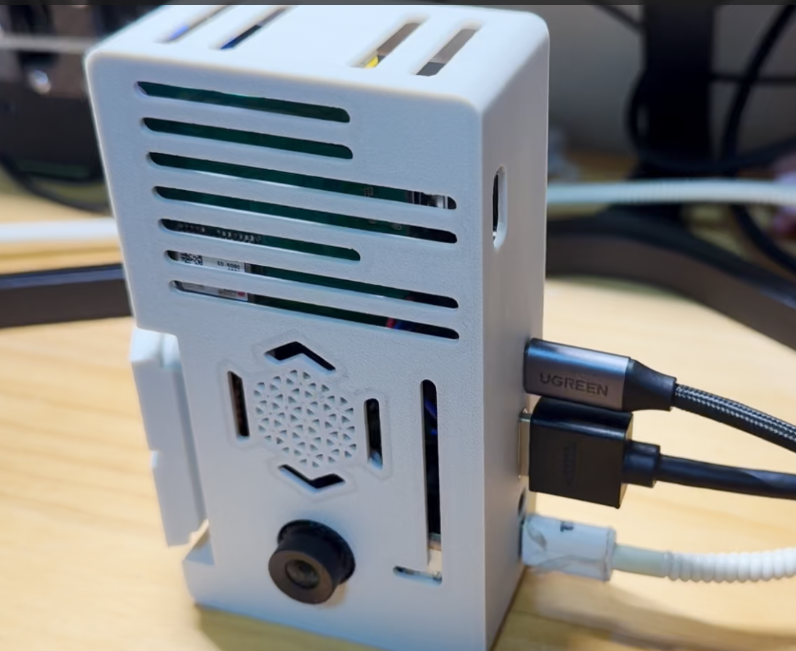
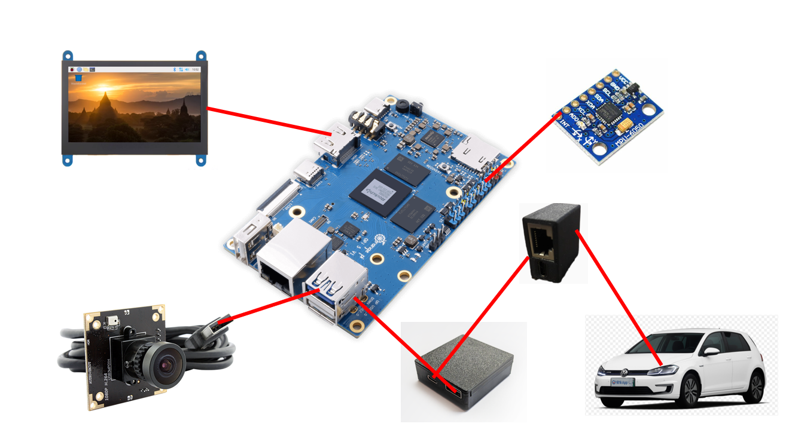

# RKPilot
基于RK3588/香橙派的openpilot软硬件;[bilibili](https://www.bilibili.com/video/BV172VZz5EEA/?share_source=copy_web&vd_source=25cfc82384a4467c4092b69e7f853bfd)

## Panda
https://github.com/lukasloetkolben/OpenpilotHardware/tree/main/BlackPanda

## 硬件图

## 软件

https://github.com/MM-X/sunnypilot-pc/tree/master-rk3588
