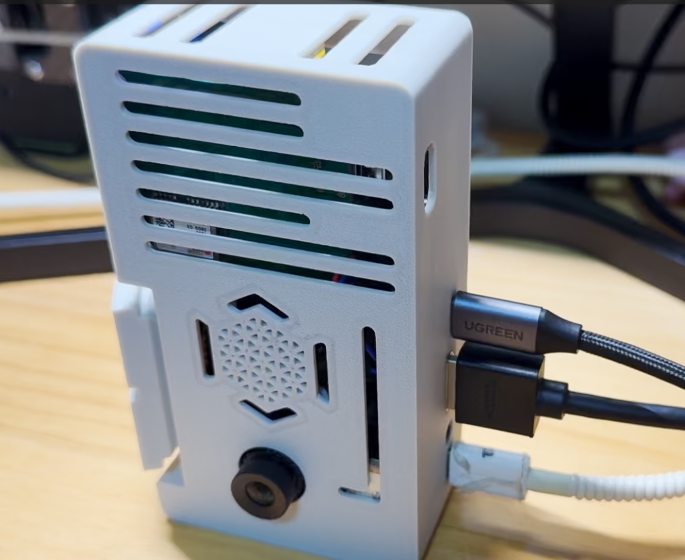
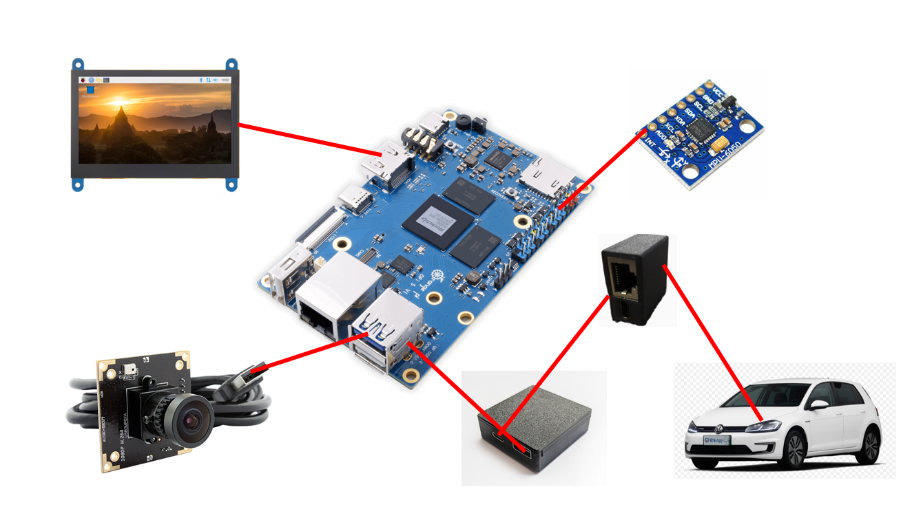

# RKPilot

基于RK3588/香橙派的openpilot软硬件!

## Video
* 【【硬核】用香橙派玩转openpilot (RKPilot)】 https://www.bilibili.com/video/BV1jhhLzKEm6/?share_source=copy_web

* 【用香橙派给油车配备驾驶助手】 https://www.bilibili.com/video/BV172VZz5EEA/?share_source=copy_web

## 硬件图

### BOM
| 硬件 | 型号 | 备注 |
| :-----------: | :-------------:| :-------------:|
| OrangePi5 | 4G/8G版本 | [OrangePi5](http://www.orangepi.cn/html/hardWare/computerAndMicrocontrollers/details/Orange-Pi-5.html) |
| UsbCam/IMX415 | 1920x1080/1280x720/20~60FPS/FOV80～90 | usb摄像头和imx415mipi摄像头均可；需要标定内参 |
| Dispaly| 800x480分辨率HDMI屏幕 | master-rk3588分支适配了这个分辨率 |
| MPU6050| common | 目前没用，后面可能会写驱动接进来 |
| Panda| common | 参考openpilot官方，保障安全的 |
| Relay| common | 参考openpilot官方，保障安全的 |

### Panda
https://github.com/lukasloetkolben/OpenpilotHardware/tree/main/BlackPanda

## 软件

https://github.com/MM-X/sunnypilot-pc/tree/master-rk3588

### KeyPoints
* 模型为v0.9.8版本，尽可能会持续更新。。。
* 使用的rk3588的GPU，没有使用NPU，原因是模型是fp32的，转换成rknn后精度损失太多，并且不做量化推理速度无明显优势
* 优化了原op软件USB Cam的接入速度，默认使用MJPG，帧率足够大于20HZ
* 修改了locationd，imu信息来自于can，因此较好的效果需要can有imu信息，（目前只用到yaw_rate）
* 受限于rk3588GPU（ARM Mali-G610）的推理速度（50～60ms）；对模型推理等一些进程做了降频处理：20HZ -> 10HZ；综合USB摄像头获取图像的延迟，整体端到端（曝光->控制）的延迟会比C3略高，粗略估计大概高100～200ms，勉强可接受
* 适配了部分BYD车型（来源yysnet）

## MIPI摄像头
参考[香橙派使用imx415](imx415/readme.md)

[imx415camera的tb购买地址](https://e.tb.cn/h.havxPLnMzUsQrZe?tk=bmSMVqqFa78);选的FOV90的

### KeyPoints
* 摄像头需要做参数标定，代码里的摄像头的参数目前是这款IMX415的参数
* 需要指定`ROAD_CAM=11`
